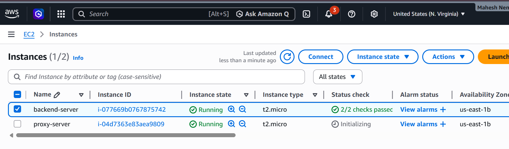
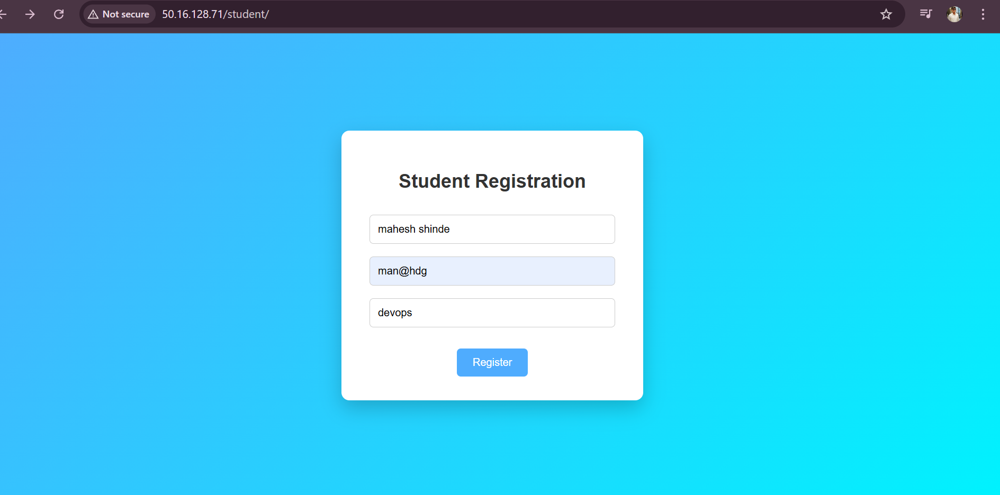
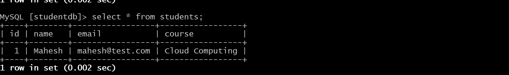
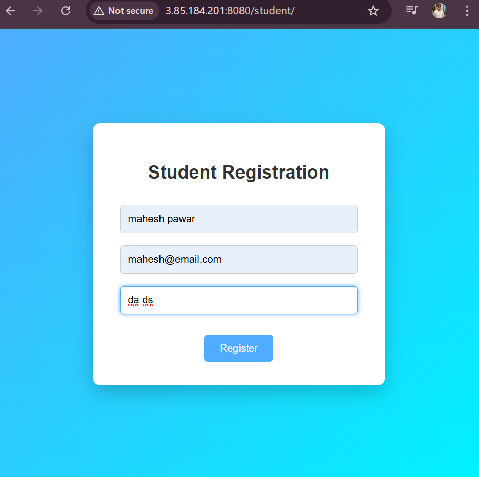

# 🚀 Java Application Deployment with Reverse Proxy on AWS

This project demonstrates deploying a **Java Student Registration Web Application** on AWS using a secure **Reverse Proxy Architecture**.

The application runs on **Apache Tomcat**, uses **Nginx as a Reverse Proxy**, and stores student data in **Amazon RDS MySQL**.

---

# 🏗 Architecture

```
User
   ↓
Nginx Reverse Proxy (EC2)
   ↓
Apache Tomcat Application Server (EC2)
   ↓
Amazon RDS MySQL
```

This architecture ensures **security, scalability, and proper traffic management**.

---

# ☁ AWS Services Used

| Service         | Purpose                                 |
| --------------- | --------------------------------------- |
| EC2             | Backend server running Apache Tomcat    |
| EC2             | Reverse Proxy server running Nginx      |
| Amazon RDS      | MySQL database for storing student data |
| Security Groups | Control network access                  |

---

# ⚙ Infrastructure Setup

Two EC2 instances were created:

### Backend Server

* Apache Tomcat installed
* Student web application deployed
* Connected to Amazon RDS database
* Running internally on **Port 8080**

### Reverse Proxy Server

* Nginx installed
* Listening on **Port 80**
* Forwarding traffic to backend server

---

# 🔐 Security Implementation

The backend server is **not publicly accessible**.

```
Internet → Proxy EC2 → Backend EC2
```

Only the **proxy server can communicate with the backend server** using AWS security groups.

This protects the application from **direct external access**.

---

# 🗄 Database Configuration

Amazon RDS MySQL database was used.

Database name:

```
studentdb
```

Table structure:

```sql
CREATE TABLE students (
id INT AUTO_INCREMENT PRIMARY KEY,
name VARCHAR(100),
email VARCHAR(100),
course VARCHAR(100)
);
```

This table stores student registration data submitted through the web application.

---

# 🌐 Application Access

The application can be accessed through the reverse proxy:

```
http://PROXY-PUBLIC-IP/student
```

The reverse proxy forwards requests to:

```
Backend EC2 : Port 8080
```

---

# 📈 Request Flow

```
User Request
     ↓
Nginx Reverse Proxy (Port 80)
     ↓
Tomcat Application Server (Port 8080)
     ↓
Amazon RDS MySQL
```

This ensures that **the backend server remains hidden from public access**.

---

# 📷 Project Screenshots

## EC2 Instances Running



---

## Student Registration Form



---

## Database Records Stored in RDS



---


## Final Application Output



---

# 🎯 Conclusion

This project successfully demonstrates a **real-world cloud deployment architecture** using AWS services.

Key achievements:

* Deployed a **Java web application** using Apache Tomcat on EC2
* Configured **Nginx Reverse Proxy** for secure access
* Implemented **Amazon RDS MySQL** database for data storage
* Applied **security group rules** to restrict direct backend access
* Built a **secure and scalable cloud architecture**

This project represents a **practical DevOps deployment workflow** involving infrastructure setup, application deployment, reverse proxy configuration, and database integration.

---

# 👨‍💻 Author

Mahesh Nengule
Cloud & DevOps Learner
